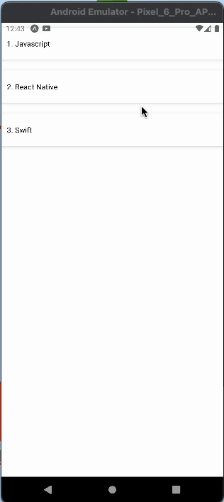
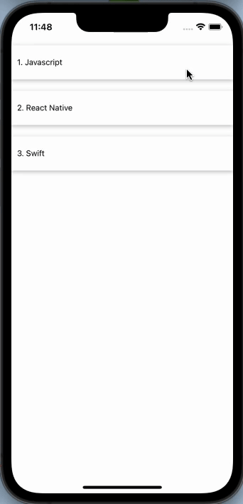

# react-native-swipeable-list-view
[](https://www.npmjs.com/package/react-native-swipeable-list-view)
 


## Example:

 


# Installation
**In order to use this package, you will also need to install *react-native-gesture-handler* to your project.**

Using npm:

```sh
npm i --save react-native-swipeable-list-view react-native-gesture-handler 
```
or using yarn:

```sh
yarn add react-native-swipeable-list-view react-native-gesture-handler 
```

## Usage:

```js

import React from 'react';
import {
  StyleSheet,
  Text,
  SafeAreaView,
  TouchableOpacity,
  Image,
  Alert,
  View
} from 'react-native';

import Swipelist from 'react-native-swipeable-list-view';

const data = [
  {
    name: 'Javascript',
  },
  {
    name: 'React Native',
  },
  {
    name: 'Swift',
  },
];

const App = () => {
  return (
    <SafeAreaView>
      <Swipelist
        data={data}
        renderRightItem={(data, index) => (
          <View key={index} style={styles.container}>
            <Text>
              {index + 1}. {data.name}
            </Text>
          </View>
        )}
        renderHiddenItem={(data, index) => (
          <View style={{ flexDirection: 'row' }}>
            <TouchableOpacity
              style={[styles.rightAction, { backgroundColor: '#bfbfbf' }]}
              onPress={() => {
                Alert.alert('Edit?', data.name);
              }}
            >
              <Image
                source={require('./pen.png')}
                style={{ width: 25, height: 25 }}
              />
            </TouchableOpacity>
            <TouchableOpacity
              style={[styles.rightAction, { backgroundColor: 'red' }]}
              onPress={() => {
                Alert.alert('Delete?', data.name);
              }}
            >
              <Image
                source={require('./tash.png')}
                style={{ width: 25, height: 25 }}
              />
            </TouchableOpacity>
          </View>
        )}
        rightOpenValue={200}
      />
    </SafeAreaView>
  );
};

const styles = StyleSheet.create({
  container: {
    height: 60,
    marginVertical: 10,
    backgroundColor: '#ffffff',
    justifyContent: 'center',
    paddingLeft: 10,
    shadowColor: '#000',
    shadowOffset: {
      width: 0,
      height: 2,
    },
    shadowOpacity: 0.25,
    shadowRadius: 3.84,
    elevation: 5,
  },

  rightAction: {
    width: '100%',
    marginVertical: 10,
    alignItems: 'center',
    flex: 1,
    justifyContent: 'center',
    height: 60,
    backgroundColor: '#ffffff',
    shadowColor: '#000',
    shadowOffset: {
      width: 0,
      height: 2,
    },
    shadowOpacity: 0.25,
    shadowRadius: 3.84,
    elevation: 5,
  },
});

export default App;

```
# Properties

Prop | Default | Type | Description 
| :------------- |:---------------:| :---------------:| :-----|
 data | - | array |  objects to be passed into the renderItem and renderHiddenItem functions **(is Required)**. |
 renderRightItem | - | function | 	How to render a row. Should return a valid React Element **(is Required)**. |
 renderHiddenItem | - | function | How to render a hidden row in a List (renders behind the row). Should return a valid React Element **(is Required)**. |
rightOpenValue | 200 | number | TranslateX value for opening the row to the right (positive number) **(is Required)**. |
 onSwipelistOpen | - | function | Called when row gets open. |
 onSwipelistClose | - | function | Called when row is closed. |
 overshootRight | false | boolean | a boolean value indicating if the swipeable row can be pulled further than the right actions row width. |
 friction | 1 | number | a number that specifies how much the visual interaction will be delayed compared to the gesture distance. e.g. value of 1 will indicate that the swipeable panel should exactly follow the gesture, 2 means it is going to be two times "slower". |


